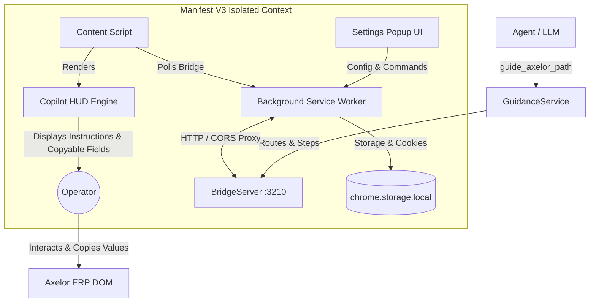

# AgenticAxelor Architecture Specification

High-density technical architecture map of the AgenticAxelor MCP server, local guidance bridge, and passive Chrome extension HUD.

---

## 1. System Topology & Data Flow

| Layer | Component | Port / Runtime | Key Responsibility |
| :--- | :--- | :--- | :--- |
| **MCP Server** | [`src/index.ts`](src/index.ts) | Node.js (Stdio) | Exposes Axelor tools (`guide_axelor_path`, `clear_axelor_guide`, `query_axelor_data`, etc.). |
| **Guidance Engine** | [`src/services/guidanceService.ts`](src/services/guidanceService.ts) | TypeScript | Resolves high-level intents into ordered `GuidanceRoute` & `GuidanceStep[]`. |
| **Local Bridge** | [`src/services/bridgeServer.ts`](src/services/bridgeServer.ts) | `http://localhost:3210` | Lightweight HTTP/SSE server managing route progression state & broadcast. |
| **Extension Proxy** | [`extension/background.js`](extension/background.js) | Manifest V3 SW | Proxies HTTPS-to-HTTP mixed content & auto-captures `JSESSIONID` cookies. |
| **HUD & Spotlight** | [`extension/spotlightEngine.js`](extension/spotlightEngine.js) | Content Script | Dual-state UI (Circle Pill $\leftrightarrow$ Glass Card), DOM element discovery, step progression. |
| **Perimeter Detector** | [`extension/content.js`](extension/content.js) | Content Script | 3-tier heuristic ERP context detection & background communication loop. |
| **Control Popup** | [`extension/popup.html`](extension/popup.html) | Extension Action | Live connection status, cookie inspection, route controls (Restart/Clear), custom domains. |

---

## 2. Component Reference & Sub-Specs

| Component | Target Spec | Key Directives |
| :--- | :--- | :--- |
| **Bridge Protocol (`:3210`)** | [`.agents/docs/bridge-protocol.md`](.agents/docs/bridge-protocol.md) | SSE stream, HTTP REST sync endpoints (`/api/guide/*`). |
| **Extension & HUD Engine** | [`.agents/docs/extension-hud.md`](.agents/docs/extension-hud.md) | 3-tier detection, Dual-State HUD UI, DOM decoupling. |
| **Axelor REST API** | [`.agents/docs/axelor-api-cheatsheet.md`](.agents/docs/axelor-api-cheatsheet.md) | Direct Axelor CRUD & search query endpoints. |
| **Data Contracts** | [`src/types/guidance.ts`](src/types/guidance.ts) | Ground truth for `GuidanceRoute`, `GuidanceStep`, and `GuidanceFieldInput`. |

---

## 3. High-Level Engineering Directives
- **Zero Java UI Scanning**: Restrict ERP introspection strictly to XML resources (`*-form.xml`, `*-menu.xml`, `*-grid.xml`).
- **DOM Decoupling**: Keep browser Copilot HUD fully isolated from Axelor host React/Angular internals.
- **Strict Typing**: Ground all payloads in typed interfaces defined in [`src/types/`](src/types/).
