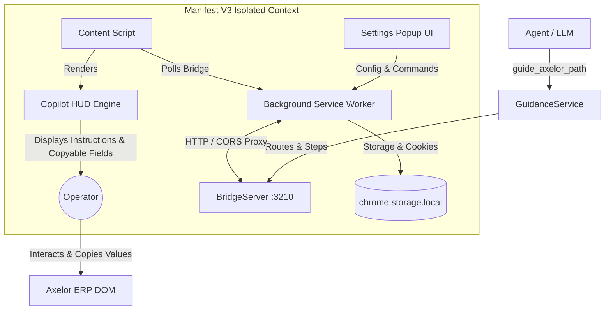

# AgenticAxelor Architecture Specification

High-density technical architecture map of the AgenticAxelor MCP server, local guidance bridge, and passive Chrome extension HUD.



---

## 1. System Topology & Data Flow

| Layer | Component | Port / Runtime | Key Responsibility |
| :--- | :--- | :--- | :--- |
| **MCP Server** | [`src/index.ts`](file:///g:/doc/projets/AgenticAxelor/src/index.ts) | Node.js (Stdio) | Exposes Axelor tools (`guide_axelor_path`, `clear_axelor_guide`, `query_axelor_data`, etc.). |
| **Guidance Engine** | [`src/services/guidanceService.ts`](file:///g:/doc/projets/AgenticAxelor/src/services/guidanceService.ts) | TypeScript | Resolves high-level intents into ordered `GuidanceRoute` & `GuidanceStep[]`. |
| **Local Bridge** | [`src/services/bridgeServer.ts`](file:///g:/doc/projets/AgenticAxelor/src/services/bridgeServer.ts) | `http://localhost:3210` | Lightweight HTTP/SSE server managing route progression state & broadcast. |
| **Extension Proxy** | [`extension/background.js`](file:///g:/doc/projets/AgenticAxelor/extension/background.js) | Manifest V3 SW | Proxies HTTPS-to-HTTP mixed content & auto-captures `JSESSIONID` cookies. |
| **HUD & Spotlight** | [`extension/spotlightEngine.js`](file:///g:/doc/projets/AgenticAxelor/extension/spotlightEngine.js) | Content Script | Dual-state UI (Circle Pill $\leftrightarrow$ Glass Card), DOM element discovery, step progression. |
| **Perimeter Detector** | [`extension/content.js`](file:///g:/doc/projets/AgenticAxelor/extension/content.js) | Content Script | 3-tier heuristic ERP context detection & background communication loop. |
| **Control Popup** | [`extension/popup.html`](file:///g:/doc/projets/AgenticAxelor/extension/popup.html) | Extension Action | Live connection status, cookie inspection, route controls (Restart/Clear), custom domains. |

---

## 2. Local Bridge Server Protocol (`localhost:3210`)

| Method | Endpoint | Payload | Response | Description |
| :--- | :--- | :--- | :--- | :--- |
| `GET` | `/api/status` | None | `{ status, port, hasActiveRoute, clientsConnected }` | Healthcheck & connection probe. |
| `GET` | `/api/guide/current` | None | `{ currentRoute, activeStepIndex, isCompleted }` | State snapshot consumed by polling clients. |
| `POST` | `/api/guide/push` | `GuidanceRoute` (JSON) | `{ success, route }` | Injects a new guidance roadmap (resets step to 0). |
| `POST` | `/api/guide/advance` | None | `{ success, activeStepIndex }` | Increments current step index by 1. |
| `POST` | `/api/guide/previous` | None | `{ success, activeStepIndex }` | Decrements current step index by 1 (down to 0). |
| `POST` | `/api/guide/reset` | None | `{ success, activeStepIndex: 0 }` | Rolls back active route to initial step (0). |
| `POST` | `/api/guide/clear` | None | `{ success, message }` | Purges active route from memory. |
| `GET` | `/api/guide/stream` | None | `text/event-stream` (SSE) | Real-time broadcast for `INIT`, `ROUTE_SET`, `STEP_ADVANCED`, `STEP_PREVIOUS`, `ROUTE_CLEARED`. |

---

## 3. Data Schema Contracts (`src/types/guidance.ts`)

```typescript
export type GuidanceStepType = "menu" | "button" | "field" | "tab" | "row";

export interface GuidanceFieldInput {
  label: string; // e.g. "Nom complet", "Email pro"
  value: string; // Exact value to copy
  hint?: string; // Optional context
}

export interface GuidanceStep {
  id: string;
  type: GuidanceStepType;
  selector: string;
  fallbackSelectors?: string[];
  label: string;
  hint: string;
  breadcrumb?: string[];
  expectedView?: string;
  valueHint?: string; // Single copyable value fallback
  fields?: GuidanceFieldInput[]; // Table of multiple copyable fields
  explanation?: string; // "💡 Bon à savoir" contextual advice
  action?: string;
  fieldName?: string;
}

export interface GuidanceRoute {
  id: string;
  title: string;
  description?: string;
  targetMenu?: string;
  targetModel?: string;
  targetField?: string;
  currentStepIndex: number;
  totalSteps: number;
  steps: GuidanceStep[];
  createdAt: string;
}
```

---

## 4. Chrome Extension Engine Architecture

### A. 3-Tier ERP Detection Pipeline ([`content.js`](file:///g:/doc/projets/AgenticAxelor/extension/content.js))
1. **Tier 1 (Host/Storage Match)**: Checks `window.location.hostname` against `chrome.storage.local.customAxelorDomains` + default keywords (`axelor`, `open-suite`).
2. **Tier 2 (DOM & Framework Markers)**: Evaluates root selectors (`[ng-app*='axelor']`, `#axelor-app`, `.navbar-axelor`, `meta[name='axelor:version']`, `link[href*='axelor']`).
3. **Tier 3 (Passive Bailout)**: Non-Axelor pages skip bridge polling and suppress HUD rendering completely.

### B. Dual-State Pure HUD Engine ([`spotlightEngine.js`](file:///g:/doc/projets/AgenticAxelor/extension/spotlightEngine.js), [`spotlight.css`](file:///g:/doc/projets/AgenticAxelor/extension/spotlight.css))
- **Design Tokens**: Pure Glassmorphism card (`rgba(255, 255, 255, 0.95)` + `blur(24px)` + subtle border & glow).
- **State 1 (Collapsed Pill)**: 48px round trigger with current step badge (`X/Y`), click-to-expand.
- **State 2 (Expanded Glass Card)**: Unfolded 380px card containing:
  - Header with step pill (`Step X/Y`) and minimize toggle.
  - Action directive (`ax-hud-instruction-box`).
  - Single copyable badge or multi-fields table (`ax-hud-fields-table`) with unit Copy triggers.
  - Contextual advice block (Pro Tip) powered by `step.explanation`.
  - Breadcrumb trail (`ax-hud-breadcrumb`).
  - Bidirectional navigation: Previous, Reset, and Next / Finish.
- **Render Cache (`lastRenderedStepKey`)**: Prevents DOM re-renders during active polling to avoid UI flickering and broken clipboard handlers.
- **DOM Decoupling**: Complete separation from host ERP internals—no synthetic auto-clicks, no DOM hijacking, no fragile outline injections.
