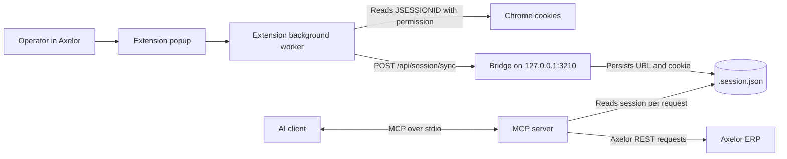

# AgenticAxelor Architecture

The MCP server and the local Bridge are separate processes. The shipped Chrome extension synchronizes the active browser session; it does not render a HUD in Axelor. See the [README](../../README.md) for setup.

## Runtime Components

| Component | Entry point | Responsibility |
| :--- | :--- | :--- |
| MCP server | [src/index.ts](../../src/index.ts) | Exposes menu, view, data, action, session-status, and guidance tools over stdio. |
| Bridge | [src/bridge.ts](../../src/bridge.ts), [bridgeServer.ts](../../src/services/bridgeServer.ts) | Listens on `127.0.0.1:3210`; accepts session sync and retains guide state and SSE endpoints. |
| Session store | [sessionStore.ts](../../src/services/sessionStore.ts) | Persists browser URL, cookie, and sync time in `.session.json`; the MCP's Axelor client reloads the session for requests. |
| Chrome extension | [manifest.json](../../extension/manifest.json), [popup.js](../../extension/popup.js), [background.js](../../extension/background.js) | Requests cookie access for the active site on user action and sends its `JSESSIONID` and base URL to the Bridge. No content script is registered. |

The Bridge writes the session to disk; the MCP server reads that file from the same project checkout rather than receiving the cookie over stdio. The session sync endpoint checks input and persistence, not whether Axelor accepts the session. Treat `.session.json` as a secret.

## Guidance Status

The MCP tools `guide_axelor_path` and `clear_axelor_guide`, [GuidanceService](../../src/services/guidanceService.ts), the [guidance contract](../../src/types/guidance.ts), and the Bridge's `/api/guide/*` endpoints still exist. They can create, store, and clear routes, but the shipped extension has no consumer for those routes. A successful guide push does not display instructions in the browser. The [former HUD specification](extension-hud.md) is historical, not an active component specification.

## References

- [Bridge protocol](bridge-protocol.md): HTTP session and retained guidance endpoints.
- [Axelor REST API](axelor-api-cheatsheet.md): ERP API reference.
- [Developer guide](DEV_GUIDE.md): commands and development workflow.
