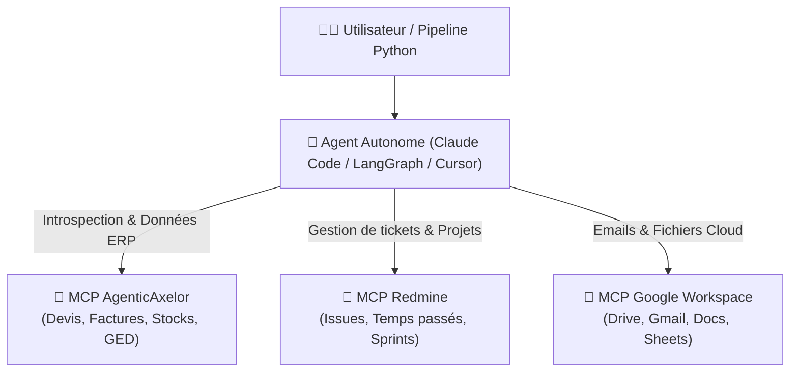

# AgenticAxelor ⚡
> Le pont standardisé (Model Context Protocol - MCP) entre les modèles d'IA / agents autonomes et votre ERP Axelor.

AgenticAxelor connecte directement votre assistant d’IA (Claude Desktop, Cursor, Goose, Pi, Claude Code, etc.) à votre instance Axelor en temps réel en utilisant votre session de travail active, de manière sécurisée et sans configuration complexe.

---

## 🌟 Pourquoi AgenticAxelor ? (La Valeur Métier en 4 Piliers)

Conçu aussi bien pour les **consultants fonctionnels**, **chefs de projet** que pour les **développeurs**, AgenticAxelor transforme votre IA en véritable expert ERP autonome :

1. 🔍 **Compréhension Profonde du Métier & Zéro Devise Inconnue** :
   - L'IA n'invente rien : elle inspecte les entités JPA, les listes déroulantes (`MetaSelect`), les relations parent/enfant (ERD) et même les champs personnalisés dynamiques créés via le **Studio Axelor** (`attrs`).
2. ⚡ **Moteur de Calcul en Temps Réel (`onChange` Simulation)** :
   - Lors de la création d'un devis ou d'une facture, l'IA simule les règles d'interface : Axelor recalcule automatiquement les prix, taxes, remises, devises et conditions de règlement avant enregistrement définitif.
3. 📄 **Bureautique, GED & Rapports PDF Directs** :
   - Dépôt, listing et téléchargement de pièces jointes (DMS). Génération et sauvegarde directe sur votre ordinateur des devis et factures aux formats **PDF, Word ou Excel** (moteurs BIRT / Jasper).
4. 🤖 **Conçu pour les Boucles d'Agents Autonomes & Multi-MCP** :
   - Capacité d'orchestrer des missions transverses en combinant Axelor avec d'autres serveurs MCP (Redmine, Google Drive, Gmail, Slack, bases SQL, etc.) ou dans des scripts Python autonomes.

---

## 🔌 Interopérabilité Multi-MCP & Workflows

AgenticAxelor implémente le standard ouvert **Model Context Protocol (MCP)**. Il ne fonctionne pas en silo : il est conçu pour être **combiné avec d'autres connecteurs MCP** dans vos outils (Cursor, Claude Desktop, Goose) ou dans des pipelines agentiques autonomes en **Python / TypeScript** (*LangGraph*, *CrewAI*, *AutoGen*, *LlamaIndex*, *n8n*).



### 💡 Ce que cela rend possible :

- **Pont Gestion de Projet ⟷ ERP (ex: Redmine / Jira)** : Réconciliation automatique entre les tickets, les temps passés par les équipes et la facturation ou le suivi d'avancement dans Axelor.
- **Bureautique & Cloud Collaboratif (ex: Google Drive, Sheets, Docs)** : Génération automatisée de bilans, synchronisation bidirectionnelle de tableaux de bord et archivage documentaire sans manipulation manuelle.
- **Communication & Traitement de Flux (ex: Gmail, Outlook, Slack)** : Détection d'événements entrants (pièces jointes, demandes clients), imputation automatique dans l'ERP et notification instantanée des parties prenantes.
- **Workflows sur mesure (Scripts Python, LangGraph, n8n)** : Automatisation de scénarios transverses complets exécutés en tâche de fond ou planifiés selon vos besoins métier.

---

### Exemple de Mission Autonome :
> *"Inspecte les commandes du client Alter-SI, crée un devis avec 3 articles X, calcule les montants avec les taxes exactes, enregistre-le et génère-moi le bon de commande en PDF sur mon bureau."*

L'agent enchaîne de manière autonome :
1. `search_axelor_models` + `inspect_axelor_model` (découverte du modèle `SaleOrder`).
2. `simulate_axelor_onchange` (dry-run du client pour récupérer le commercial et les conditions de paiement).
3. `batch_axelor_operations` (création atomique de la commande et de ses lignes).
4. `generate_axelor_report` (génération BIRT/Jasper et téléchargement direct du PDF sur le disque).

---

## ⚠️ Précautions & Sécurité (Ce qu'il faut savoir)

> [!WARNING]
> **Sécurité des Données & Responsabilité** :
> - **Mêmes droits que votre utilisateur** : L'IA utilise directement votre session et hérite de **toutes vos permissions**. Si vous êtes administrateur, elle a le pouvoir réel d'écrire, modifier ou supprimer des données.
> - **Vérifiez avant de valider** : Demandez à l'IA de lister ou de simuler (`simulate_axelor_onchange`) les modifications avant de commiter des changements en masse.
> - **Environnement recommandé** : Privilégiez systématiquement une instance de **test / recette / staging** avant toute utilisation sur votre production.
> - **Confidentialité de session** : Ne partagez jamais le fichier `.session.json` généré en local (il contient votre cookie temporaire). Ce fichier est exclu de Git par défaut.

---

## 🧰 Les 18 Outils MCP Disponibles (Tableau Métier)

| Domaine | Outil MCP | Description Fonctionnelle | Exemple de Prompt |
| :--- | :--- | :--- | :--- |
| **Authentification** | `sync_axelor_session` | Adopte la session connectée dans votre navigateur | *"Vérifie ma connexion Axelor"* |
| **Schéma & Modèles** | `search_axelor_models` | Recherche les entités et tables de la base | *"Trouve le nom technique du modèle Facture"* |
| | `inspect_axelor_model` | Détaille tous les champs, types et relations d'une entité | *"Quels sont les champs obligatoires sur SaleOrder ?"* |
| | `inspect_axelor_selections` | Traduit les listes déroulantes et codes de statuts | *"Que signifie statusSelect = 3 sur un devis ?"* |
| | `get_axelor_schema_relations`| Explore les clés étrangères entrantes et sortantes | *"Quels modèles référencent le modèle Partner ?"* |
| | `inspect_axelor_custom_fields` | Détecte les champs personnalisés Studio (`attrs`) | *"Y a-t-il des champs custom sur les clients ?"* |
| **Navigation & Vues** | `search_axelor_menu` | Retrouve le chemin d'un menu et son fil d'Ariane | *"Où se trouve le menu Gestion des Stocks ?"* |
| | `inspect_axelor_view` | Inspecte l'organisation d'une vue formulaire ou grille | *"Quels sont les onglets du formulaire contact ?"* |
| **Données & Requêtes** | `query_axelor_data` | Recherche avec filtres et tris | *"Liste les 10 derniers devis confirmés"* |
| | `fetch_axelor_record` | Récupère un enregistrement précis par son ID | *"Donne-moi le détail complet du client #42"* |
| | `export_axelor_data` | Exporte de gros volumes en CSV ou JSON | *"Exporte tous les clients actifs dans un fichier CSV"* |
| **Actions & Calculs** | `simulate_axelor_onchange` | Calcule les montants, taxes et règles sans sauvegarder | *"Simule l'ajout du client X sur ce devis"* |
| | `save_axelor_record` | Crée ou met à jour un enregistrement | *"Crée un prospect avec le nom Dupont SARL"* |
| | `batch_axelor_operations` | Exécute plusieurs créations/mises à jour en un appel | *"Mets à jour ces 5 articles en une seule fois"* |
| | `delete_axelor_record` | Supprime un enregistrement | *"Supprime la ligne de commande #108"* |
| | `execute_axelor_action` | Déclenche un bouton ou une action métier | *"Valide la commande client #19"* |
| **Audit & Historique**| `get_axelor_audit_log` | Affiche l'historique des modifications d'un champ | *"Qui a modifié le prix de cet article et quand ?"* |
| **GED & Documents** | `get_axelor_attachments` | Liste les fichiers attachés à un enregistrement | *"Quelles sont les pièces jointes de la facture #1 ?"* |
| | `upload_axelor_attachment` | Dépose un fichier local sur une fiche Axelor | *"Attache ce contrat PDF sur la fiche client"* |
| | `download_axelor_attachment` | Télécharge un fichier attaché sur votre ordinateur | *"Télécharge la pièce jointe #14 sur mon bureau"* |
| | `list_axelor_templates` | Découvre les modèles d'impression BIRT/Jasper/Email | *"Quels modèles d'impression existent pour les devis ?"* |
| | `generate_axelor_report` | Génère et télécharge un rapport PDF/Word/Excel | *"Génère le PDF de la facture #123 sur mon bureau"* |
| | `get_axelor_bpm_state` | Diagnostic des workflows BPMN et tâches actives | *"Quel est l'état du workflow de validation sur ce devis ?"* |

---

## 🚀 Démarrage Rapide

### Option A : Installation Assistée par l'IA (Recommandé)
Si vous ouvrez ce projet dans un IDE assisté (Cursor, Goose, Pi, Claude Code...) :
1. Téléchargez et décompressez le projet.
2. Demandez simplement à votre agent :
   > **"Lance le setup du projet"** (ou tapez `/setup-assistant`)
3. L'agent configure Node, installe, compile et lance le Bridge pour vous.

---

### Option B : Installation Manuelle en 4 Étapes

#### 1. Prérequis & Installation
- [Node.js](https://nodejs.org/) (v18+ ou v22 recommandée).
- Dans le dossier du projet :
  ```bash
  npm install
  npm run build
  ```

#### 2. Configuration du Client MCP
Ajoutez le serveur dans la configuration de votre outil MCP (Cursor, Claude Desktop, etc.) :
```json
{
  "mcpServers": {
    "agentic-axelor": {
      "command": "node",
      "args": ["<CHEMIN_ABSOLU_DU_PROJET>/dist/index.js"]
    }
  }
}
```

#### 3. Lancer le Bridge de Session
- **Sous Windows** : Double-cliquez sur **`start-bridge.bat`**.
- **Sous macOS / Linux** : Lancez `npm run bridge`.

#### 4. Synchroniser avec l'Extension Chrome
1. Dans Chrome (`chrome://extensions`), activez le **Mode développeur** et chargez le dossier [`extension/`](extension/).
2. Connectez-vous à votre ERP Axelor.
3. Cliquez sur l'icône de l'extension et cliquez sur **Synchroniser la session**.

Votre agent IA est immédiatement opérationnel sur votre ERP !

---

## 📚 Documentation Technique
- [Guide Développeur & CLI](.agents/docs/DEV_GUIDE.md)
- [Architecture & Protocoles](.agents/docs/ARCHITECTURE.md)
- [Arbres de Décision Opérateur](.agents/standard-index.md)
- [Cheatsheet API REST Axelor](.agents/docs/axelor-api-cheatsheet.md)