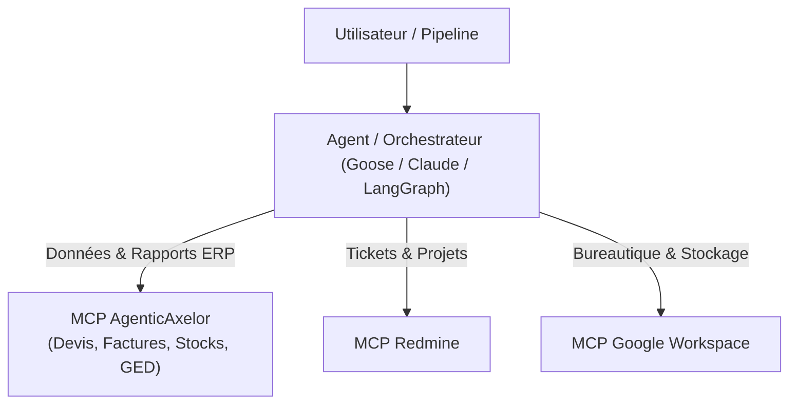

# AgenticAxelor

> Connecteur MCP pour accélérer le travail des équipes (Chefs de Projet & Développeurs) sur l'ERP Axelor.

AgenticAxelor relie directement votre assistant d'IA (Goose, Cursor, Claude Code, etc.) à votre instance Axelor en réutilisant en direct votre session de travail, en toute sécurité.

---

## 🎯 Pourquoi AgenticAxelor ?

Transformez votre assistant IA en copilote ERP opérationnel :

- **Compréhension instantanée** : Retrouvez la structure des écrans, les listes de choix et les champs personnalisés en quelques secondes.
- **Simulation en temps réel** : Testez les calculs automatiques (taxes, remises, devises) avant validation de fiches.
- **Gestion documentaire & Rapports** : Générez devis ou factures (PDF/Excel) et gérez vos pièces jointes sans clic superflu.
- **Audits & Exports rapides** : Exportez des données ciblées (CSV/Excel) et consultez l'historique des modifications en un message.

---

## 👥 Cas d'Usage Quotidiens

### 📋 Chef de Projet & Consultant Fonctionnel
- **Vérification de paramétrage** : Identifier les champs obligatoires, listes actives ou menus.
- **Aide à la recette** : Générer des jeux de données cohérents et valider les calculs automatiques.
- **Synthèse & Cadrage** : Exporter rapidement des listes filtrées pour vos réunions client.

### 💻 Développeur & Intégrateur
- **Exploration du modèle** : Visualiser les relations entre objets métier sans requête SQL manuelle.
- **Structure des écrans** : Inspecter la composition des formulaires, onglets et grilles.
- **Automatisation & Actions** : Déclencher et tester les actions métier directement depuis l'assistant.

---

## 🛠️ Capacités MCP (18 Outils Clés)

| Domaine | Outils Inclus | Utilité concrète |
| :--- | :--- | :--- |
| 🔐 **Connexion** | `sync_axelor_session` | Réutilise votre session navigateur avec vos droits et permissions exacts. |
| 🏗️ **Structure** | `search_axelor_models`<br>`inspect_axelor_model`<br>`inspect_axelor_selections`<br>`get_axelor_schema_relations`<br>`inspect_axelor_custom_fields` | Explorer les objets métier, listes déroulantes et champs personnalisés. |
| 🧭 **Navigation** | `search_axelor_menu`<br>`inspect_axelor_view` | Retrouver un menu et comprendre l'organisation d'un écran. |
| 📊 **Données & Export** | `query_axelor_data`<br>`fetch_axelor_record`<br>`export_axelor_data` | Rechercher, filtrer et exporter des données (CSV / JSON / Excel). |
| ⚙️ **Mises à jour & Calculs** | `simulate_axelor_onchange`<br>`save_axelor_record`<br>`batch_axelor_operations`<br>`delete_axelor_record`<br>`execute_axelor_action`<br>`get_axelor_audit_log` | Simuler les calculs, créer/modifier des fiches (seules ou en lot) et tracer les audits. |
| 📁 **Documents & Processus** | `get_axelor_attachments`<br>`upload_axelor_attachment`<br>`download_axelor_attachment`<br>`list_axelor_templates`<br>`generate_axelor_report`<br>`get_axelor_bpm_state` | Gérer les pièces jointes, générer des rapports (PDF/Excel) et suivre les processus. |

---

## 🔒 Sécurité & Bonnes Pratiques

> [!WARNING]
> - **Permissions identiques** : L'agent hérite strictement de vos droits d'accès sur l'ERP.
> - **Simulation recommandée** : Privilégiez les simulations de calculs et requêtes de lecture avant toute mise à jour en masse.
> - **Environnement** : Préférez une instance de recette / staging avant tout usage en production.
> - **Confidentialité** : Le fichier `.session.json` contient votre cookie temporaire et reste strictement local (exclu de Git).

---

## 🚀 Guide d'Installation

### Option A : Installation Guidée avec Goose (Recommandé)

1. **Téléchargez et décompressez** le projet sur votre poste.
2. **Ouvrez Goose** et sélectionnez le dossier décompressé (*Workspace*).
3. **Dans le chat**, demandez simplement :
   > **"Lance le setup du projet"** (ou `/setup-assistant`)
4. L'agent configure l'environnement, compile et démarre le service Bridge local.
5. Chargez l'extension Chrome (dossier `extension/`) et cliquez sur **Synchroniser la session** sur votre page Axelor.

---

### Option B : Installation Manuelle

1. **Compiler le projet** :
   ```bash
   npm install
   npm run build
   ```

2. **Déclarer le serveur MCP** dans la configuration de votre client :
   ```json
   {
     "mcpServers": {
       "agentic-axelor": {
         "command": "node",
         "args": ["<CHEMIN_ABSOLU_DU_PROJET>/dist/index.js"]
       }
     }
   }
   ```

3. **Démarrer le Bridge** :
   - Windows : exécuter `start-bridge.bat`
   - macOS / Linux : `npm run bridge`

4. **Synchroniser la session** :
   - Chargez l'extension Chrome non empaquetée depuis `extension/`.
   - Cliquez sur **Synchroniser la session** depuis votre ERP Axelor.

---

## 🤖 Intégration Multi-Agents & Automatisation

AgenticAxelor s'intègre naturellement avec d'autres connecteurs MCP dans des chaînes de traitement automatisées :



---

## 📚 Documentation Technique

- [Guide Développeur & CLI](file:///c:/Users/Pablo/Documents/Alter-si/AgenticAxelor/.agents/docs/DEV_GUIDE.md)
- [Architecture & Protocoles](file:///c:/Users/Pablo/Documents/Alter-si/AgenticAxelor/.agents/docs/ARCHITECTURE.md)
- [Arbres de Décision Opérateur](file:///c:/Users/Pablo/Documents/Alter-si/AgenticAxelor/.agents/standard-index.md)
- [Cheatsheet API REST Axelor](file:///c:/Users/Pablo/Documents/Alter-si/AgenticAxelor/.agents/docs/axelor-api-cheatsheet.md)