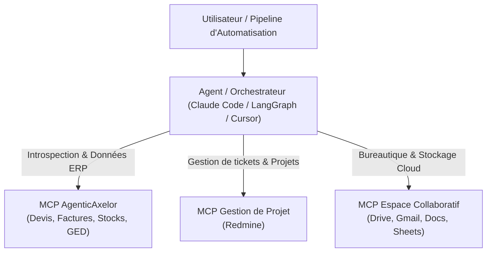

# AgenticAxelor

> Le connecteur MCP officiel pour accélérer le travail quotidien des équipes (Chefs de Projet, Développeurs) sur l'ERP Axelor.

AgenticAxelor connecte directement votre assistant d’IA (Cursor, Claude Desktop, Goose, Pi, Claude Code, etc.) à votre instance Axelor en temps réel en exploitant votre session de travail active, de manière sécurisée et sans configuration complexe.

---

## Pourquoi AgenticAxelor au Quotidien ?

Conçu pour faire gagner un temps précieux aux **chefs de projet**, et **développeurs**, AgenticAxelor transforme votre IDE ou client IA en copilote ERP opérationnel :

1. **Introspection & Documentation Instantanée** :
   - Plus besoin de chercher dans le code source ou la console SQL : l'agent inspecte en 2 secondes les entités JPA, les listes de sélection (`MetaSelect`), les relations de clés étrangères (ERD) et les champs personnalisés créés dans le **Studio Axelor** (`attrs`).
2. **Moteur de Calcul en Temps Réel (Simulation `onChange`)** :
   - Testez et simulez les règles métier complexes (calcul des taxes, remises, devises, conditions de règlement) en direct avant toute validation ou enregistrement réel.
3. **GED & Génération de Documents Directs** :
   - Dépôt, listing et téléchargement de pièces jointes (DMS). Génération et enregistrement immédiat des devis, factures ou états de stocks aux formats **PDF, Word ou Excel** (BIRT / Jasper).
4. **Gain de Productivité & Diagnostics Rapides** :
   - Extraction de données à la volée (CSV/JSON), audit des modifications de champs (`get_axelor_audit_log`) et diagnostic de l'état des workflows BPMN sans navigation manuelle fastidieuse.

---

## Cas d'Usage Quotidiens par Profil

### Pour le Chef de Projet & Consultant Fonctionnel
- **Vérification de paramétrage** : Identifier rapidement les champs obligatoires d'un formulaire, les listes déroulantes actives ou l'arborescence des menus.
- **Assistance à la recette** : Générer des jeux de données de test cohérents et vérifier les calculs automatiques (taxes, totaux, remises) en une simple phrase.
- **Extraction & Synthèse rapide** : Exporter facilement les données ciblées sous Excel/CSV pour préparer une réunion client, un atelier de cadrage ou un point d'avancement.

### Pour le Développeur & Intégrateur
- **Exploration du modèle de données** : Comprendre instantanément les liens entre les tables et objets sans ouvrir d'outil de base de données.
- **Inspection des formulaires & écrans** : Analyser la structure des écrans, les grilles et les champs personnalisés ajoutés dans Axelor.
- **Validation des actions & automatisations** : Déclencher les actions métier et tester le comportement des formulaires directement depuis l'assistant.

---

## Capacités & Outils MCP (18 Fonctions Clés)

AgenticAxelor met à disposition de votre assistant une suite de 18 fonctionnalités couvrant vos besoins du quotidien sur l'ERP :

| Domaine | Outils Inclus | À quoi ça sert concrètement ? |
| :--- | :--- | :--- |
| **Connexion & Sécurité** | `sync_axelor_session` | Réutilise automatiquement votre connexion active du navigateur, avec exactement les mêmes droits et accès que vous. |
| **Structure & Personnalisation** | `search_axelor_models`<br>`inspect_axelor_model`<br>`inspect_axelor_selections`<br>`get_axelor_schema_relations`<br>`inspect_axelor_custom_fields` | Explorer les objets métier, les listes de choix, les liens entre écrans et retrouver les champs personnalisés créés dans l'ERP. |
| **Navigation & Menus** | `search_axelor_menu`<br>`inspect_axelor_view` | Retrouver un menu, comprendre l'organisation des écrans (onglets, formulaires, tableaux). |
| **Recherche & Export** | `query_axelor_data`<br>`fetch_axelor_record`<br>`export_axelor_data` | Trouver des fiches, filtrer des informations précises et exporter des listes de données au format Excel/CSV. |
| **Mise à jour & Règles de Calcul** | `simulate_axelor_onchange`<br>`save_axelor_record`<br>`batch_axelor_operations`<br>`delete_axelor_record`<br>`execute_axelor_action`<br>`get_axelor_audit_log` | Simuler les calculs automatiques d'un formulaire avant validation, créer ou modifier des fiches (seules ou en masse), lancer une action et consulter l'historique des modifications. |
| **Documents, Rapports & Processus** | `get_axelor_attachments`<br>`upload_axelor_attachment`<br>`download_axelor_attachment`<br>`list_axelor_templates`<br>`generate_axelor_report`<br>`get_axelor_bpm_state` | Consulter et joindre des pièces jointes, générer des rapports (devis, factures, récapitulatifs en PDF/Excel) et suivre l'avancement des processus métier. |

---

## Sécurité & Bonnes Pratiques

> [!WARNING]
> **Sécurité des Données & Responsabilité** :
> - **Héritage des droits utilisateur** : L'agent utilise votre session et dispose de **l'ensemble de vos permissions**. Si vous êtes administrateur, il dispose des droits de création, modification et suppression.
> - **Simulation préalable** : Privilégiez les simulations (`simulate_axelor_onchange`) ou les requêtes de lecture avant d'exécuter des modifications en masse.
> - **Environnement recommandé** : Utilisez prioritairement une instance de **test / recette / staging** avant tout usage en environnement de production.
> - **Confidentialité de session** : Le fichier local `.session.json` contient votre cookie de session temporaire et ne doit pas être partagé. Il est exclu du versionnement Git par défaut.

---

## Guide d'Installation

### Option A : Installation Assistée par l'IA (Recommandé avec Goose)
1. **Téléchargez et décompressez** l'archive du projet sur votre poste de travail.
2. **Ouvrez Goose** et sélectionnez le dossier décompressé comme répertoire de travail (Workspace / Working directory).
3. **Dans le chat de Goose**, écrivez simplement :
   > **"Lance le setup du projet"** (ou `/setup-assistant`)
4. L'agent s'occupe de tout : installation des dépendances, compilation et lancement du service de connexion (Bridge local).
5. Installez l'extension Chrome (fournie dans le sous-dossier `extension/`) et cliquez sur **Synchroniser la session** sur votre onglet Axelor.

---

### Option B : Installation Manuelle

#### 1. Prérequis & Compilation
- [Node.js](https://nodejs.org/) (v18+ ou v22 recommandée).
- Dans le répertoire du projet :
  ```bash
  npm install
  npm run build
  ```

#### 2. Déclaration dans le Client MCP
Ajoutez la configuration suivante dans votre client MCP (Cursor, Claude Desktop, etc.) :
```json
{
  "mcpServers": {
    "agentic-axelor": {
      "command": "node",
      "args": ["<CHEMIN_ABSOLU_DU_PROJET>/dist/index.js"]
    }
  }
}
```

#### 3. Démarrage du Bridge de Session
- **Sous Windows** : Exécutez **`start-bridge.bat`**.
- **Sous macOS / Linux** : Lancez `npm run bridge`.

#### 4. Synchronisation via l'Extension Navigateur
1. Dans Google Chrome (`chrome://extensions`), activez le **Mode développeur** et chargez le dossier [`extension/`](file:///c:/Users/Pablo/Documents/Alter-si/AgenticAxelor/extension).
2. Connectez-vous à votre ERP Axelor.
3. Cliquez sur l'icône de l'extension puis sur **Synchroniser la session**.

Votre agent IA est immédiatement connecté à votre instance Axelor.

---

## Usage Avancé : Workflows Multi-MCP & Agents Autonomes

En plus de l'usage interactif au quotidien, AgenticAxelor respecte le standard ouvert **Model Context Protocol (MCP)** et peut s'intégrer dans des chaînes de traitement automatisées :



- **Scénarios transverses** : Rapprochement automatique de temps passés (Redmine), synchronisation de tableaux de bord Cloud, traitement automatisé de pièces jointes.
- **Frameworks compatibles** : *LangGraph*, *CrewAI*, *AutoGen*, *LlamaIndex*, *n8n* ou scripts autonomes en Python / TypeScript.

---

## Documentation Technique
- [Guide Développeur & CLI](file:///c:/Users/Pablo/Documents/Alter-si/AgenticAxelor/.agents/docs/DEV_GUIDE.md)
- [Architecture & Protocoles](file:///c:/Users/Pablo/Documents/Alter-si/AgenticAxelor/.agents/docs/ARCHITECTURE.md)
- [Arbres de Décision Opérateur](file:///c:/Users/Pablo/Documents/Alter-si/AgenticAxelor/.agents/standard-index.md)
- [Cheatsheet API REST Axelor](file:///c:/Users/Pablo/Documents/Alter-si/AgenticAxelor/.agents/docs/axelor-api-cheatsheet.md)